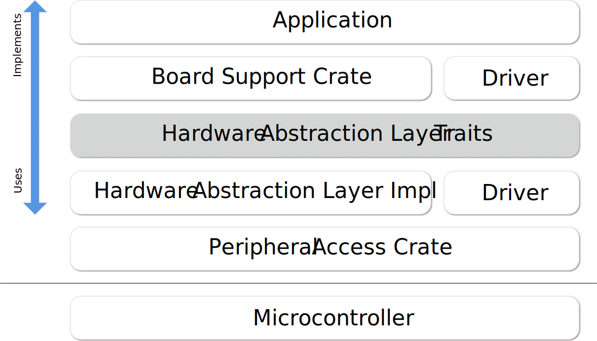

# 可移植性

在嵌入式环境中，可移植性是一个非常重要的指标：每家厂商或一家厂商中的不同系列都提供不同的外设与功能，并且交互的方法也不同。

一个普遍的方法是通过硬件抽象层，或者说是 **HAL** 解决。

> 硬件抽象是软件中的一组程序，他们模拟某些平台特定的操作细节，来让程序可以直接访问硬件资源。
>
> 他们提供对于硬件的标准 OS 接口可以让程序员来写出不依赖于设备，高性能的程序。
>
> *Wikipedia: [Hardware Abstraction Layer]*

[Hardware Abstraction Layer]: https://en.wikipedia.org/wiki/Hardware_abstraction

嵌入式系统在这方面有些特殊，因为我们通常没有操作系统，也不能安装软件，固件是作为一个整体来编译的，有着许多其他限制。
因此，尽管 Wikipedia 所定义的传统方法可能有用，但是并不是一个最有效的方法来确保可移植性。

我们怎么在 Rust 中做？来看看 **embedded-hal**...

## 什么是 **embedded-hal**？

简而言之，它是一组 trait ，它定义了 **HAL 的实现**，**驱动**还有**应用（或固件）**。这些约定包括能力（例如，如果你为某些类型实现了 trait ，那 **HAL** 就为它提供了一系列功能）和方法（例如，如果你构建了一个实现 trait 的类型，那就可以使用他的方法）。

典型的分型可能如下所示：

**embedded-hal** 中定义的一些 trait 如下：

* GPIO （输入输出引脚）
* 串行通信
* I2C
* SPI
* 计数器、定时器
* 数模转换

设计 **embedded-hal** trait 与 crate 并使用他们的原因是为了控制复杂性。
考虑一下，如果某一个应用必须实现硬件外设的使用方法，并且可能使用其他驱动，那么保持可移植性是很难的。
用数学一点的方法来表示，如果 **M** 是外设HAL实现的数量， **N** 是驱动的数量，那么如果我们为每一个应用重新造轮子，那么最终会得到 **M * N** 种实现，但是使用 **embedded-hal** trait 提供的 *API* 会把复杂度降低到 **M + N**。当然也有其他好处，例如这些定义良好、反复测试过的易用 API 。

## embedded-hal 的应用场合

如前所述， HAL 的应用场合如下：

### HAL 实现

HAL 实现提供了硬件与 HAL traits 用户的交互。典型的实现包括三个部分：

* 一个或多个硬件具体类型
* 提供多个配置（速度，操作方式，引脚等）来创建或初始化一个类型的函数
* 一个或多个 **embedded-hal** 中 `trait` 的 `impl`

这样的一个 **HAL 实现**有如下几种实现形式：

* 通过低级硬件全是先，如寄存器
* 通过操作系统，如在linux下通过 `sysfs`
* 通过适配器，如单元测试中的 mock
* 通过硬件适配器驱动，如 I2C 多路复用 或 GPIO 拓展

### 驱动

一个驱动为一个内部或外部的连接到实现了 embedded-hal traits 的组件实现一系列功能。
典型的例子包括各种传感器（温度，磁场，加速器，光），显示设备（ LED ， LCD 显示器）还有执行器（马达，发送器）。

一个驱动需要一个实现了 embedded-hal `trait` 的类型来初始化，这通过类型绑定来保证，并且为它自身提供一系列方法来让使用者与被驱动的设备来交互。

### 应用

应用将各个部分组合在一起来实现所需功能。在不同系统间移植时需要花费大量精力，因为应用程序需要通过 HAL 来正确的初试话实际硬件，并且不同的硬件之间初始化方法也有不同。此外，用户的决定通常也有着很大的影响，因为硬件可以物理的连接到不同位置，硬件有时候需要外部硬件才能正确配置，或者在使用内部设备时也面临着不同的选择（例如，多个定时器有着不同的功能并且可能有冲突）
